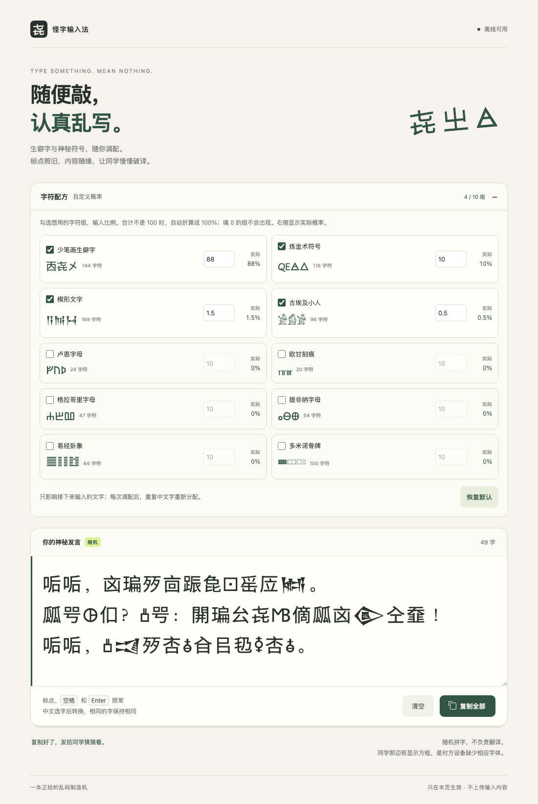

# funny-characters · 怪字输入法

随便敲，认真乱写。

一个会把你输入的文字变成“有规律的胡话”的网页小工具。默认以少笔画生僻字为主，也可以自由选择 10 组怪字符、调配出现概率；敲几下键盘，再复制给同学猜猜看。



## 直接使用

1. 下载本仓库，双击 `index.html`，用浏览器打开。
2. 点击输入框，随便输入文字。英文按键即时转换；中文输入法完成选字后转换。
3. 点击 **复制全部**，粘贴到聊天里。

不用安装依赖，不需要服务器，断网也能使用。保存或转发单独一个 `index.html` 即可。

## 自定义概率

展开输入框上方的 **字符配方**，勾选想用的组，修改数字。比例支持小数，范围为 0–100；未勾选或设为 0 的组不会生成。数字会自动折算成总计 100% 的概率，右侧实时显示结果：例如只启用两组，分别填 `2.5`、`7.5`，实际概率就是 `25%`、`75%`。

调整配方只影响接下来输入的文字，并重置重复中文字的对应关系；已生成的内容保留。全部关闭或比例全部为 0 时暂停输入，仍可复制、清空。点击 **恢复默认** 回到原配方；刷新页面也会恢复默认，不保存输入内容或个人设置。

| 字符组 | 数量 | 默认概率 | 样例 |
|---|---:|---:|---|
| 少笔画生僻字 | 144 | 88% | 㐂㞢㐺 |
| 炼金术符号 | 116 | 10% | 🜀🜁🜂 |
| 楔形文字 | 169 | 1.5% | 𒀀𒀁𒀂 |
| 古埃及小人 | 96 | 0.5% | 𓀀𓀁𓀂 |
| 卢恩字母 | 24 | 关闭 | ᚠᚢᚦ |
| 欧甘刻痕 | 20 | 关闭 | ᚁᚂᚃ |
| 格拉哥里字母 | 47 | 关闭 | ⰀⰁⰂ |
| 提非纳字母 | 54 | 关闭 | ⴰⴱⴲ |
| 易经卦象 | 64 | 关闭 | ䷀䷁䷂ |
| 多米诺骨牌 | 100 | 关闭 | 🀰🀱🀲 |

字符组名称与范围可对照 Unicode 官方码表：[卢恩](https://www.unicode.org/charts/PDF/U16A0.pdf)、[欧甘](https://www.unicode.org/charts/PDF/U1680.pdf)、[格拉哥里](https://www.unicode.org/charts/PDF/U2C00.pdf)、[提非纳](https://www.unicode.org/charts/PDF/U2D30.pdf)、[易经卦象](https://www.unicode.org/charts/PDF/U4DC0.pdf)、[多米诺骨牌](https://www.unicode.org/charts/PDF/U1F030.pdf)。本工具仅随机拼字，不表达这些文字或符号的原有含义。

## 能做什么

- **144 个生僻汉字全部少于 15 画**，按 Unicode Unihan 17.0.0 的记录筛选；其中 97 个不超过 8 画。
- 共 **10 组、834 个字符**，可单独开关和自定义概率；默认配方保持生僻汉字 88%、炼金术符号 10%、楔形文字 1.5%、古埃及象形文字 0.5%。
- 中文重复字保持相同：例如“哈哈，哈哈！”会变成类似“㐂㐂，㐂㐂！”的形式。对应关系在当前配方下有效，清空不会重置，调整配方或刷新页面后重新随机。不同输入字可能对应同一个输出字，不用于加密。
- 保留 Unicode 标点、空格和换行；其余每个 Unicode 码点替换成一个字符。内容不做语义翻译。
- 支持粘贴、选区替换、光标插入和退格删除。
- 支持 `⌘Z / Ctrl+Z` 撤销、`⌘⇧Z / Ctrl+Shift+Z` 重做，以及一键清空。
- 一键复制；浏览器不允许自动复制时，保留选中的文本供手动复制。
- 页面内嵌所需字体，不使用 CDN，不上传输入内容，不写入本地存储。

上述比例是每次新抽取的概率；重复中文字复用已有结果，因此短句中的实际占比不固定。

这是只在网页输入框内生效的娱乐工具，没有安装系统输入法，也不提供古文字翻译。复制出去的是 Unicode 文本；接收方的设备若缺少对应字体，可能显示方框。

## 源代码

所有程序代码都在 `index.html`：

- `<style>`：页面样式和内嵌的 WOFF2 字体。
- `<main>`：界面。
- `<script>`：分组字符池 `characterGroups`、概率设置、按权重抽取、中文对应表、输入事件、撤销和复制逻辑。

直接编辑 HTML 即可。字符池中的字都有随文件提供的字体；添加新字符时，需要确认字体是否覆盖它们。

逐字笔画、筛选规则和官方数据来源保存在 [character-data.json](character-data.json)。笔画依据 [Unihan 17.0.0](https://www.unicode.org/Public/17.0.0/ucd/Unihan.zip) 的 `kTotalStrokes`，并检查 `kAlternateTotalStrokes`；“生僻”和字形趣味性是人工选字判断。

没有构建步骤，也没有运行时依赖。若要用本地 HTTP 服务预览，可在仓库目录运行：

```sh
python3 -m http.server 8000
```

然后访问 `http://localhost:8000`。


## 已验证

2026-09-21 在 macOS 上使用 Chromium 151 测试了本地 HTML 文件：

- 完全离线加载，九种字体全部成功载入，834 个字符均有对应字形。
- 144 个汉字的笔画记录全部为 2–14，20,000 次抽样符合四类设定比例。
- 自定义小数比例及 20,000 次抽样、单组生成、禁用组排除、零比例、空值与越界值、恢复默认。
- 连续中文重复字、跨段复用、保留标点和空白，以及重复标点间的光标位置。
- 键盘输入、空格、换行、中文输入法连续选字及取消选字。
- 增补平面字符完整删除、光标插入、选区替换、清空、撤销和重做。
- 实际复制后粘贴核对，以及 Clipboard API 不可用时的复制回退。
- 1100、390、320 像素视口布局与配方展开/收起；没有 JavaScript 错误或外部网络请求。

## 许可证

程序代码采用 [MIT License](LICENSE)。内嵌字体分别采用 **SIL Open Font License 1.1**；完整版权、来源与许可证见 [THIRD_PARTY_NOTICES.md](THIRD_PARTY_NOTICES.md)。字体不适用项目的 MIT 许可证。笔画数据衍生自 Unicode Unihan，适用 Unicode License V3，完整许可同样见第三方声明并随单文件附带。

---

A tiny offline Unicode keyboard toy. Type anything, get random unusual characters, and copy them into a chat. Plain HTML/CSS/JavaScript, embedded fonts, no runtime dependencies.
